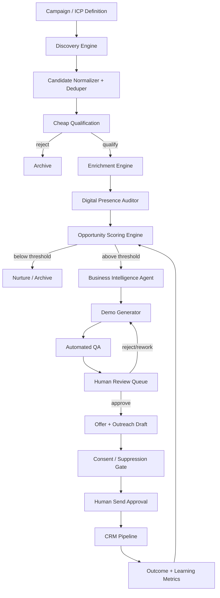
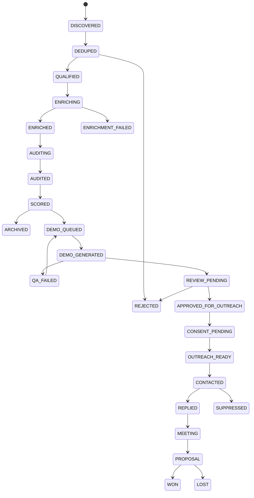

# Local Business Opportunity Engine — v0.1 System Blueprint

**Status:** Architecture baseline  
**Date:** 2026-09-25  
**Goal:** Turn the manual “find a local business → understand its gaps → build a demo → pitch the result” process into a controlled, measurable, semi-automated system.

---

## 1. Product thesis

The product is not a Google Maps scraper and not an AI website builder. It is a **local-business acquisition operating system**.

Its job is to answer five questions reliably:

1. **Which businesses are worth our time?**
2. **What exactly is missing or weak in their digital presence?**
3. **What solution should we propose to this specific business?**
4. **Can we show that solution before asking for a sale?**
5. **Can we learn from the conversion outcome and improve the process?**

The commercial mechanism is **show-before-sell**: the prospect sees a tailored, credible concept rather than receiving a generic “we build websites” pitch.

---

## 2. Product boundaries

### In scope

- Local-business discovery by geography + category
- Deduplication and identity resolution
- Website/social/contact discovery from permitted sources
- Technical website audit
- Online conversion audit
- Business intelligence brief
- Opportunity scoring
- Demo website generation
- Package/offer recommendation
- Human review queue
- Consent-aware outreach workflow
- CRM state and follow-up events
- Funnel, quality and cost metrics

### Out of scope for v0.1

- Fully autonomous cold outreach
- Autonomous negotiation
- Automatic domain purchase
- Automatic client production deployment
- Bulk social-media scraping
- Unbounded website generation from arbitrary code agents
- Reselling raw scraped/Places datasets

---

## 3. Architecture principles

### 3.1 Adapter-first ingestion

No source owns the architecture. Each source implements a common adapter contract.

```text
Discovery Adapter
    -> CandidateBusiness[]

Enrichment Adapter
    -> EnrichmentSnapshot

Audit Adapter
    -> AuditResult
```

This lets us use, replace or disable:

- Google Maps scraper kit
- Google Places API
- Local directories
- Business-owned websites
- CRM imports
- Manually entered prospects

without rewriting scoring, demo generation or CRM logic.

### 3.2 Cheap-first funnel

Expensive operations happen only after inexpensive qualification.

```text
10,000 discovered candidates
      ↓ dedupe/basic rules
2,000 potentially relevant
      ↓ lightweight web checks
500 qualified
      ↓ deep enrichment + audit
150 high-potential
      ↓ demo generation
30–50 human-reviewed demos
      ↓ compliant outreach
conversion funnel
```

Numbers are illustrative; the platform must measure actual economics and recalibrate.

### 3.3 Structured AI, not chat blobs

LLMs should consume and produce typed objects wherever possible.

Bad:

```text
Paste several pages of reviews into a prompt and ask for a website.
```

Preferred:

```json
{
  "business": {...},
  "verified_services": [...],
  "brand_signals": [...],
  "digital_gaps": [...],
  "target_actions": [...],
  "source_provenance": [...]
}
```

### 3.4 Human-controlled irreversible actions

The system may automatically discover, inspect, draft and generate. A human approves:

- whether a prospect enters outreach
- whether a generated claim is acceptable
- whether a demo can be shared
- whether an outreach message is sent
- whether a lead should be suppressed

---

## 4. High-level system architecture



### Core services

| Service | Responsibility | MVP implementation |
|---|---|---|
| Discovery | Find candidate businesses | Python adapter service |
| Identity | Dedupe and resolve business identity | API + PostgreSQL |
| Enrichment | Retrieve deeper facts from approved sources | Adapter workers |
| Auditor | Website/mobile/conversion checks | Playwright worker |
| Scoring | Explainable opportunity score | Pure rules engine |
| Intelligence | Structured business/offer brief | LLM service |
| Generator | Build preview | Template renderer + LLM copy |
| QA | Validate factual, visual and technical quality | Rules + browser tests + LLM critique |
| CRM | Lead state, activities, approvals | Core API |
| Operator UI | Review/operate the funnel | Next.js |

---

## 5. Campaign and ICP model

A **Campaign** defines the search and qualification context.

Example:

```yaml
name: "Salon Pilot"
vertical: "hair_salon"
geographies:
  - "Target City A"
queries:
  - "hair salon"
  - "braiding salon"
qualification:
  minimum_rating: null
  minimum_reviews: null
  require_phone: true
  allow_existing_website: true
demo_budget_per_lead: 0.30
human_review_required: true
```

A campaign has a versioned **ICP policy**, because what makes a good lead differs by vertical.

For example:

- salon: booking + WhatsApp + visual portfolio matter strongly
- restaurant: menu + reservations + maps/hours + order CTA matter strongly
- real estate: listings + lead capture + WhatsApp + agent trust signals matter strongly
- church: service times + location + livestream + giving/contact flows matter strongly

---

## 6. Lead lifecycle/state machine

The lead state is authoritative and event-driven.



Every transition creates a `pipeline_event` row with timestamp, actor and reason.

---

## 7. Canonical business profile

The platform needs one normalized object independent of source.

```json
{
  "business_id": "uuid",
  "identity": {
    "display_name": "Example Salon",
    "canonical_name": "example-salon",
    "category": "hair_salon",
    "place_id": "optional",
    "address": "verified source dependent",
    "coordinates": null
  },
  "contact": {
    "phone": null,
    "email": null,
    "website": null,
    "whatsapp": null
  },
  "presence": {
    "website_status": "missing|healthy|weak|broken|unknown",
    "booking": false,
    "whatsapp_cta": false,
    "socials": []
  },
  "audit": {
    "mobile": 0,
    "performance": 0,
    "seo_basics": 0,
    "accessibility": 0,
    "conversion": 0
  },
  "opportunity": {
    "score": 0,
    "band": "low|medium|high",
    "components": []
  },
  "provenance": []
}
```

### Provenance is mandatory

Each fact should record:

```json
{
  "field": "contact.website",
  "source_type": "business_website|places_api|scraper|manual|directory",
  "source_ref": "...",
  "observed_at": "...",
  "expires_at": "...",
  "storage_policy": "persistent|ephemeral|reference_only",
  "confidence": 0.98
}
```

This is essential for correctness, freshness and source-policy compliance.

---

## 8. Discovery engine

### Adapter contract

```python
class DiscoveryAdapter(Protocol):
    async def discover(self, request: DiscoveryRequest) -> list[CandidateBusiness]: ...
```

### Candidate schema

Minimum fields:

- source
- source business identifier
- display name
- source URL
- category
- approximate locality
- website-present flag if available
- phone-present flag if available
- observed timestamp

Do not force every source into a large schema during discovery. Deep fields belong in enrichment.

### Google Maps scraper kit integration

Use the Mahanaicoach kit as an **experimental/high-volume discovery adapter**, not as the platform database or core domain model.

Integration shape:

```text
Discovery Job
  -> scraper-kit local REST API
  -> poll job
  -> normalize rows
  -> dedupe
  -> discard unnecessary raw payload
```

Recommended controls:

- one job per worker/IP at first
- strict per-campaign depth caps
- source feature flag
- kill switch
- job-level rate telemetry
- explicit source policy classification
- never assume scraped contact data is automatically eligible for marketing

### Production resilience

The discovery layer must also support compliant alternatives so the business is not dependent on one scraper:

- manually supplied lists
- client-owned CRM exports
- permitted business directories
- official APIs within their usage rules
- targeted web discovery

---

## 9. Enrichment engine

### Why separate enrichment from discovery

Discovery optimizes for coverage; enrichment optimizes for confidence.

The `deonna/google-maps-downloader` reference is useful because it already separates:

- URL parsing
- Places API client
- transformation
- review analysis
- JSON output
- Markdown output

We should reuse the architectural idea, but adapt storage behavior to current Google policies.

### Places enrichment flow

```text
Candidate business
   ↓
Resolve/confirm Place ID
   ↓
Request only required fields using field masks
   ↓
Use response ephemerally where policies require
   ↓
Create permitted references / provenance
   ↓
Persist only fields allowed by source policy
```

**Important:** the system must not blindly persist the repository's entire JSON output. Places content has caching/storage and attribution requirements. Place IDs are specifically permitted to be stored; other content requires policy-aware handling.

### Enrichment priority order

1. Business-owned website
2. Business-controlled public profiles where terms allow use
3. Official/approved API data under its usage terms
4. Other permitted directories
5. Human verification

Business-owned sources should be preferred for facts used in generated demos.

---

## 10. Digital Presence Auditor

The auditor turns subjective “weak website” judgments into measurable features.

### Website availability

- no website
- DNS failure
- TLS failure
- HTTP error
- redirect loop
- parked domain
- valid site

### Mobile/UX checks

- viewport configuration
- responsive overflow
- tap-target issues
- navigation usability
- CTA visibility above fold
- phone/WhatsApp clickability

### Conversion checks

Detect:

- booking/reservation flow
- WhatsApp action
- click-to-call
- contact form
- quote/request form
- product/menu/service catalogue
- pricing visibility
- map/location CTA
- lead capture

### Technical checks

- HTTPS
- title/meta description
- canonical tag
- structured data presence
- broken internal links
- image size/alt presence
- major console/network errors
- basic accessibility checks
- performance indicators

### Brand/content checks

These are lower-confidence AI-assisted signals and must remain separately labelled:

- service clarity
- value proposition clarity
- visual consistency
- trust signals
- freshness indicators
- photography quality
- testimonial/review presentation

Never mix deterministic and subjective findings without marking the difference.

---

## 11. Opportunity Score v1

The score answers:

> “How much addressable digital opportunity exists for this business, weighted by our ability to deliver a credible solution?”

It does **not** claim the business is poorly run.

### Scoring layers

```text
A. Addressable gap       0–55
B. Commercial readiness  0–20
C. Reachability          0–10
D. Demo confidence       0–15
                        -------
                         0–100
```

### Example components

#### A. Addressable gap

- no usable website: +20
- technically weak website: up to +12
- no primary conversion path: +10
- no online booking where vertical expects it: +8
- poor mobile UX: +5

#### B. Commercial readiness

Signals such as:

- business appears active
- clear service catalogue exists
- enough first-party material exists to build a truthful demo
- existing digital activity suggests interest in online acquisition

Avoid using protected/sensitive attributes.

#### C. Reachability

- verified business contact channel
- contact channel allowed by campaign outreach policy
- no suppression flag

#### D. Demo confidence

- sufficient verified facts
- suitable imagery or placeholders
- vertical template fit
- low factual ambiguity

### Negative adjustments

- business appears closed: strong penalty
- no verifiable contact route: penalty
- duplicate/chain branch ambiguity: penalty
- compliance conflict: automatic hold
- weak data confidence: penalty

### Output

Every score returns:

```json
{
  "score": 82,
  "band": "high",
  "version": "opportunity-v1",
  "components": [
    {"code":"NO_WEBSITE","points":20,"evidence":"..."},
    {"code":"NO_BOOKING","points":8,"evidence":"..."}
  ],
  "holds": [],
  "recommended_next_action": "generate_demo"
}
```

Never store only the total.

---

## 12. AI agent responsibilities

Use separate agents/functions with narrow contracts rather than one general agent.

### 12.1 Business Intelligence Agent

**Input:** normalized verified facts + audit  
**Output:** structured `BusinessBrief`

Responsibilities:

- summarize what the business does
- derive service taxonomy only when evidence supports it
- identify target actions for the site
- describe brand tone conservatively
- flag unknowns instead of inventing them

### 12.2 Opportunity Analyst

**Input:** audit + vertical playbook  
**Output:** prioritized gaps and recommended capabilities

Rules engine remains authoritative for numeric score. The LLM explains, it does not arbitrarily override points.

### 12.3 Demo Copywriter

Generates:

- hero copy
- service descriptions
- CTA copy
- contact/location text
- FAQ only from supportable facts or clearly generic questions

Must attach source references to factual claims.

### 12.4 Demo Designer

Selects from controlled design tokens/templates rather than emitting arbitrary code in v0.1.

### 12.5 QA Reviewer

Checks:

- unsupported claims
- wrong address/phone/hours
- placeholder leakage
- broken buttons
- misleading endorsements
- copied content exceeding permitted use
- attribution requirements

### 12.6 Outreach Drafter

Creates a short, factual message referencing only genuine detected opportunities. It never sends automatically.

---

## 13. Demo generation strategy

### Do not start with unconstrained “vibe coding”

For the MVP, reliability beats novelty.

Use:

```text
BusinessBrief JSON
      ↓
Vertical template selection
      ↓
Design-token selection
      ↓
Structured copy generation
      ↓
Static site render
      ↓
Browser QA
      ↓
Preview deployment
```

### Template anatomy

Default sections:

1. Hero
2. Primary CTA
3. Services
4. Why choose / trust signals
5. Gallery or safe placeholders
6. Contact / location
7. Hours if verified and permitted
8. Secondary CTA

Optional vertical sections:

- salon → booking, service cards, style gallery
- restaurant → menu, reservation, order CTA
- real estate → listings/lead form
- church → service times, ministries, livestream links
- school → admissions enquiry, programmes, contact

### Preview safety

Each demo must display a discreet concept banner such as:

> “Concept preview prepared independently for demonstration. Not the official website of this business.”

No fake testimonials, awards, claims, pricing or staff names.

### Asset policy

Prefer:

1. client/business-owned assets with clear rights
2. appropriately licensed stock
3. generated decorative imagery where suitable
4. placeholders

Treat third-party platform photos/reviews according to source terms and attribution requirements; do not automatically rehost them in previews.

---

## 14. Automated QA gates

A preview may enter human review only if all blocking checks pass.

### Technical

- page returns 200
- no broken first-party assets
- primary CTA target is valid
- mobile viewport passes
- no critical JS errors
- preview banner present

### Data integrity

- business name matches canonical record
- phone/address only included when verified
- all factual claims have allowed provenance
- no stale/expired source data
- no unsupported “best”, “leading”, “award-winning” style claims

### Content

- no prompt leakage
- no model disclaimers
- no invented staff/prices/services
- no copied review text unless use/attribution is permitted

### Visual

- no text overflow
- no empty sections
- images have coherent aspect ratios
- contrast/accessibility baseline

---

## 15. Operator experience

The operator dashboard is the heart of the MVP.

### Prospect list

Columns:

- business
- category
- location
- website state
- opportunity score
- top 3 gaps
- data confidence
- lead state
- next action

### Prospect detail

```text
Business summary
Source/provenance status
Digital audit
Opportunity score breakdown
Screenshots
Recommended package
Generated demo
QA report
Outreach draft
Timeline
```

### Review actions

- approve demo
- request regeneration
- edit claim
- approve for consent request/outreach
- suppress lead
- mark duplicate
- mark closed/not relevant

---

## 16. Offer engine

Do not use one generic “website package.” Build offers from capabilities.

Capability catalog:

- landing page
- full business website
- hosting/maintenance
- domain setup
- WhatsApp CTA/automation
- online booking
- enquiry forms
- menu/service catalogue
- local SEO basics
- analytics
- conversion tracking
- reputation/review workflow
- AI receptionist (later)
- content updates (recurring)

### Example package logic

```text
If website_missing && booking_needed:
    recommend Presence + Booking

If website_exists && mobile_score_low:
    recommend Website Refresh

If website_good && conversion_score_low:
    recommend Conversion Upgrade
```

Pricing should be configured by market/campaign, not hard-coded into the scoring engine.

---

## 17. Outreach and consent workflow

Outreach is a separate domain because “we found a contact detail” does not mean “we may market to it.”

### Required entities

- `contact_channel`
- `consent_record`
- `suppression_entry`
- `outreach_draft`
- `outreach_event`

### Rules

- no automatic mass send in MVP
- suppression always wins
- every send logs source, approver, message, channel and timestamp
- first-contact behavior is jurisdiction-aware
- campaign policy decides whether channel is allowed
- one-click operator suppression
- stop follow-up immediately after opt-out

For South African electronic direct marketing, POPIA Section 69 is a key constraint; build a consent-request workflow rather than assuming a scraped/public contact detail is valid permission for promotional messaging.

---

## 18. Data model

Core tables:

- `campaigns`
- `businesses`
- `business_aliases`
- `source_observations`
- `contacts`
- `websites`
- `audit_runs`
- `audit_findings`
- `opportunity_scores`
- `opportunity_components`
- `business_briefs`
- `generated_demos`
- `demo_qa_runs`
- `offers`
- `outreach_drafts`
- `outreach_events`
- `consents`
- `suppression_entries`
- `pipeline_events`
- `jobs`
- `cost_events`

See `db/001_initial.sql` for the starter schema.

---

## 19. API surface

Primary MVP endpoints:

```text
POST   /v1/campaigns
GET    /v1/campaigns/{id}
POST   /v1/campaigns/{id}/discover
GET    /v1/businesses
GET    /v1/businesses/{id}
POST   /v1/businesses/{id}/enrich
POST   /v1/businesses/{id}/audit
POST   /v1/businesses/{id}/score
POST   /v1/businesses/{id}/demo
GET    /v1/demos/{id}
POST   /v1/demos/{id}/review
POST   /v1/businesses/{id}/offer
POST   /v1/businesses/{id}/outreach-draft
POST   /v1/outreach/{id}/approve
POST   /v1/outreach/{id}/record-send
POST   /v1/businesses/{id}/suppress
GET    /v1/pipeline
GET    /v1/metrics/funnel
```

See `api/openapi.yaml`.

---

## 20. Workflow orchestration

### MVP

Use PostgreSQL as system of record + Redis-backed workers.

Each job is idempotent:

```text
DISCOVER_CAMPAIGN
NORMALIZE_CANDIDATES
AUDIT_WEBSITE
ENRICH_BUSINESS
CALCULATE_SCORE
GENERATE_BRIEF
GENERATE_DEMO
QA_DEMO
```

Each accepts a deterministic idempotency key.

### Later

Move to Temporal or equivalent when we need:

- workflows spanning days/weeks
- compensation/retry logic
- many dependent branches
- external approval waits
- high job volume and strict observability

Do not add a complex orchestrator before it earns its cost.

---

## 21. Deployment model

### Development

Docker Compose:

- Postgres
- Redis
- local S3-compatible object store
- API
- worker
- operator web app

### Production

Recommended split:

```text
Operator Web        -> managed web host
Core API            -> container service
Workers             -> container/queue workers
PostgreSQL          -> managed Postgres
Redis               -> managed Redis
Object storage      -> S3-compatible
Generated previews  -> static preview host
Secrets             -> managed secret store
```

### Network separation

Scraper workers, if enabled, should run separately from the public API and have their own rate controls and kill switch.

---

## 22. Observability and cost control

Track per lead:

- discovery source cost
- API requests
- browser-audit runtime
- LLM input/output tokens
- generation cost
- preview hosting cost
- operator review time
- outreach attempts
- revenue outcome

Core economic metric:

```text
Expected Value per Qualified Lead
= P(close | score band, vertical) × expected gross profit
  - processing cost
  - operator cost
```

This eventually replaces arbitrary scoring assumptions with observed conversion economics.

---

## 23. Metrics

### Funnel

- candidates discovered
- dedupe rate
- qualification rate
- enrichment success rate
- high-score rate
- demo generation rate
- demo approval rate
- consent/outreach eligible rate
- reply rate
- meeting rate
- proposal rate
- win rate

### Quality

- factual-error rate per demo
- human regeneration rate
- unsupported-claim rate
- broken-preview rate
- duplicate rate
- stale-data rate

### Economics

- cost per discovered lead
- cost per qualified lead
- cost per approved demo
- cost per meeting
- cost per won customer
- gross margin by package

---

## 24. MVP: first 20–50 businesses

The pilot should intentionally stay narrow.

### Scope

- one vertical
- one target geography
- 20–50 prospects
- manual campaign definition
- discovery from one adapter + manual import fallback
- website audit
- v1 score
- one deterministic vertical template
- LLM business brief + copy
- static demo URL
- human review
- manually recorded outreach
- funnel metrics

### Success criteria

Technical:

- ≥90% of selected businesses process without manual data repair
- zero unsupported factual claims in shared demos
- preview generation under a few minutes per lead
- every score explainable
- every fact shows provenance

Product:

- operator can process a lead end-to-end from one dashboard
- operator can regenerate/edit a demo without touching code
- clear reason exists for every accepted/rejected lead

Commercial learning:

- measure which gap patterns lead to replies and meetings
- compare high/medium score bands
- identify which package proposition resonates

---

## 25. Build order

### Phase 0 — Foundations

1. Define vertical pilot
2. Implement database
3. Implement source/provenance model
4. Implement campaign model
5. Implement lead state machine
6. Set compliance/suppression defaults

### Phase 1 — Discovery + audit

1. Discovery adapter interface
2. Integrate scraper-kit in sandbox/feature flag
3. Manual CSV import
4. Deduplication
5. Website resolver
6. Playwright audit
7. Operator prospect list

### Phase 2 — scoring + enrichment

1. Config-driven score engine
2. Source-policy-aware enrichment adapter
3. Business profile view
4. Score explanation UI
5. Cost tracking

### Phase 3 — demo system

1. Business brief schema
2. LLM structured extraction
3. One vertical template
4. Static site renderer
5. QA gates
6. Preview deployer
7. Review UI

### Phase 4 — offers + CRM

1. Capability catalog
2. Offer rules
3. Outreach drafts
4. Consent/suppression workflow
5. Timeline
6. Funnel analytics

### Phase 5 — calibration

1. Score vs reply/meeting analysis
2. Adjust score weights
3. Add second vertical
4. Add second discovery source
5. Evaluate automation safely

---

## 26. Decisions deliberately postponed

Do not lock these in before the pilot gives evidence:

- final brand/product name
- exact LLM vendor
- exact preview hosting vendor
- exact queue/orchestrator beyond MVP
- autonomous sending
- multi-tenant SaaS architecture
- complex agent frameworks
- vector database requirement
- automated proposal/payment stack

---

## 27. Definition of “v0.1 complete”

v0.1 is complete when an operator can:

1. create a campaign
2. discover/import candidates
3. deduplicate them
4. inspect objective web gaps
5. see an explainable opportunity score
6. enrich a selected lead
7. generate a truthful structured business brief
8. generate a working mobile demo
9. see automated QA results
10. approve/reject/regenerate the demo
11. create an offer
12. create a compliant outreach draft
13. manually record contact and outcome
14. view the entire funnel and costs

That is enough to test the business model before investing in high-scale automation.

